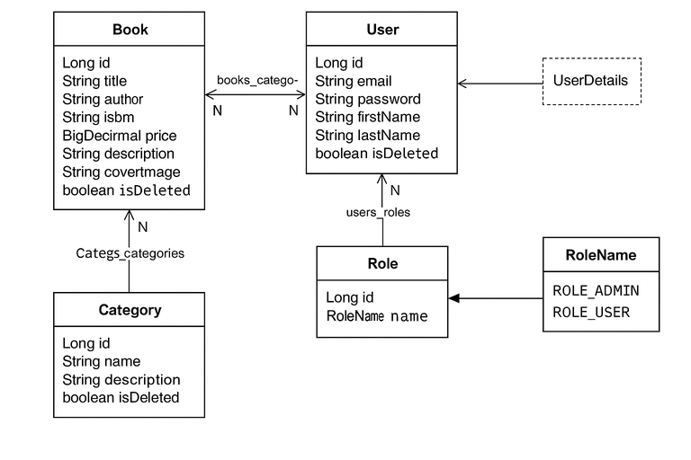

# 📚 Book Marketplace API

A production-grade RESTful backend application built using **Spring Boot**, **Spring Security (JWT)**, **Spring Data JPA**, **MySQL**, **Liquibase**, and **Docker Compose**.  
This project demonstrates clean architecture, robust authentication, full CRUD functionality, and enterprise-grade development patterns.

---

## 🚀 Overview

This application provides the backend for an online book marketplace.  
It supports:

- 🔐 Secure registration & login via **JWT**
- 📘 Book management (CRUD)
- 🏷 Category management
- 🧾 Order placement and tracking
- 📄 Swagger UI for API documentation
- 🗄 Database versioning with Liquibase
- 🐳 Docker Compose for environment setup

---

## 🛠 Technologies Used

| Technology | Description |
|-----------|-------------|
| **Java 17** | Primary language |
| **Spring Boot 3** | App framework |
| **Spring Security + JWT** | Auth & authorization |
| **Spring Data JPA (Hibernate)** | DB layer |
| **MySQL 8** | Production database |
| **Liquibase** | DB schema migration |
| **MapStruct** | Entity <-> DTO mapping |
| **Lombok** | Removes boilerplate |
| **Docker Compose** | Runs MySQL + app |
| **Swagger / OpenAPI** | API documentation |
| **JUnit 5 + MockMvc** | Integration tests |

---
## 📊 Entity Relationships


## 🧩 Architecture Overview

```
Controller → Service → Repository → Database
                ↓
             Security
```

✔ Controllers — expose REST API  
✔ Services — business logic  
✔ Repositories — JPA DB operations  
✔ Security — JWT + roles  
✔ Entities/DTOs — clean data structures

---

## 🔐 Authentication Flow (JWT)

1. **POST /auth/registration** — register new user  
2. **POST /auth/login** — receive JWT token  
3. Include token for protected endpoints:

```
Authorization: Bearer <your_token>
```

Roles:

- `ROLE_USER`
- `ROLE_ADMIN`

---

## 📦 Local URLs

```
http://localhost:8080/books
http://localhost:8080/auth/login
http://localhost:8080/swagger-ui/index.html
```

---

## Postman Collection

### 🔑 Authentication

#### Register a New User
- **Endpoint**: `POST /api/auth/registration`
- **Description**: Registers a new user.
- **Example Link**: [http://localhost:8080/auth/registration](http://localhost:8080/auth/registration)
- **Request Body**:
  ```json
  {
    "email": "bob@example.com",
    "password": "123456789",
    "repeatPassword": "123456789",
    "firstName": "Bob",
    "lastName": "Alis",
    "shippingAddress": "Bob's address"
  }
  ```
- **Response**:
    - **Status Code**: `200 Ok`
    - **Body**:
  ```json
  {
    "id": 5,
    "email": "bob@example.com",
    "firstName": "Bob",
    "lastName": "Alis",
    "shippingAddress": "Bob's address"
  }
  ```
#### User Login
- **Endpoint**: `POST /api/auth/login`
- **Description**: Logs in a registered user. Accessible for all users.
- **Example Link**: [http://localhost:8080/api/auth/login](http://localhost:8080/api/auth/login)
- **Request Body**:
  ```json
  {
    "email": "bob@example.com",
    "password": "123456789"
  }
  ```
- **Response**:
    - **Status Code**: `200 Ok`
    - **Body**:
   ```json
  {
  "token": "your_jwt_token_here"
  }
  ```
### 📖 Book

#### Get All Books
- **Endpoint**: `GET /api/books`
- **Description**: Returns a list of all stored books. Accessible for roles **User** and **Admin**.
- **Example Link**: [http://localhost:8080/books](http://localhost:8080/books)
- **Response**:
    - **Status Code**: `200 OK`
    - **Body** (example):

```json
{
"content": [
{
"id": 1,
"title": "Triumphal arch",
"author": "Erich Maria Remarque",
"isbn": "rfg-156-45-062f",
"price": 89.00,
"description": "This is a sample book description.",
"coverImage": "http://example.com/test.jpg",
"categoryIds": [
1
]
},
{
"id": 3,
"title": "Kobzar",
"author": "Taras Shevchenko",
"isbn": "s3n-1f3-hg-4562",
"price": 54.00,
"description": "This is a sample book description2.",
"coverImage": "http://example.com/test2.jpg",
"categoryIds": [
2
]
}
],
"page": {
"size": 10,
"number": 0,
"totalElements": 2,
"totalPages": 1
}
}
  ```
#### Get Book by ID
- **Endpoint**: `GET /api/books/{id}`
- **Description**: Returns a book by the specified ID. Accessible for roles **User** and **Admin**.
- **Example Link**: [http://localhost:8080/books/3](http://localhost:8080/api/books/3)
- **Response**:
    - **Status Code**: `200 OK`
    - **Body** (example):
 ```json
{
  "id": 3,
  "title": "Kobzar",
  "author": "Taras Shevchenko",
  "isbn": "s3n-1f3-hg-4562",
  "price": 54.00,
  "description": "This is a sample book description2.",
  "coverImage": "http://example.com/test2.jpg",
  "categoryIds": [
    2
  ]
}
```

#### Create a New Book
- **Endpoint**: `POST /api/books`
- **Description**: Creates a new book in the database. Accessible for role **Admin**. **WARNING! Before adding a book, the corresponding category must be added**
- **Example Link**: http://localhost:8080/books
- **Request Body**:
```json
{
  "title": "Book",
  "author": "Author",
  "isbn": "yhg-839-78-345",
  "price": 965.00,
  "description": "Description",
  "coverImage": "https://example.com/newbook-cover-image.jpg",
  "categoryIds": [1, 6]
}
```
- **Response**:
    - **Status Code**: `201 Created`
    - **Body** (example):
```json
{
  "id": 6,
  "title": "Book",
  "author": "Author",
  "isbn": "yhg-839-78-345",
  "price": 965.00,
  "description": "Description",
  "coverImage": "https://example.com/newbook-cover-image.jpg",
  "categoryIds": [1, 2]
}
```
#### Update a Book
- **Endpoint**: `PATCH /api/books/{id}`
- **Description**: Updates the book with the specified ID. Accessible for role **Admin**.
- **Example Link**: [http://localhost:8080/books/1](http://localhost:8080/books/1)
- **Request Body**:
```json
{
  "title": "Book",
  "author": "New Author",
  "isbn": "yhg-839-78-345",
  "price": 432.22,
  "description": "New description",
  "coverImage": "https://example.com/newbook-cover-image.jpg",
  "categoryIds": [1, 2]
}
```
- **Response**:
    - **Status Code**: `200 Ok`
    - **Body** (example):
```json
{
  "id": 6,
  "title": "Book",
  "author": "New Author",
  "isbn": "yhg-839-78-345",
  "price": 432.22,
  "description": "New description",
  "coverImage": "https://example.com/newbook-cover-image.jpg",
  "categoryIds": [1, 2]
}
```
#### Delete a Book
- **Endpoint**: `DELETE /api/books/{id}`
- **Description**: Soft-deletes a book with the specified ID from the database. Accessible for role **Admin**.
- **Example Link**: [http://localhost:8080/books/6](http://localhost:8080/books/6)
- **Response**:
    - **Status Code**: `204 No content`

### 📜 Category

#### Create a New Category
- **Endpoint**: `POST /api/categories`
- **Description**: Creates a new category. Accessible for role **Admin**.
- **Example Link**: [http://localhost:8080/categories](http://localhost:8080/categories)
- **Request Body**:
```json
{
  "name": "Sport",
  "description": "Books about sport"
}
```
- **Response**:
    - **Status Code**: `201 Created`
    - **Body** (example):
```json
{
  "id": 3,
  "name": "Sport",
  "description": "Books about sport"
}
```
#### Get All Categories
- **Endpoint**: `GET /api/categories`
- **Description**: Returns a list of all categories from the database. Accessible for roles **User** and **Admin**.
- **Example Link**: [http://localhost:8080/categories](http://localhost:8080/categories)
- **Response**:
    - **Status Code**: `200 Ok`
    - **Body** (example):
```json
{
  "content": [
    {
      "id": 1,
      "name": "Adventures",
      "description": "Books set in futuristic or imaginative worlds"
    },
    {
      "id": 2,
      "name": "Sport",
      "description": "Detective stories and whodunits"
    },
    {
      "id": 3,
      "name": "Drama",
      "description": "Life stories of notable individuals"
    }
  ],
  "page": {
    "size": 10,
    "number": 0,
    "totalElements": 3,
    "totalPages": 1
  }
}
```

#### Delete a Category
- **Endpoint**: `DELETE /api/categories/{id}`
- **Description**: Soft-deletes the category with the specified ID. Accessible for role **Admin**.
- **Example Link**: [http://localhost:8080/categories/9](http://localhost:8080/categories/9)
- **Response**:
    - **Status Code**: `204 No content`

## 🐳 Running with Docker Compose

### 1️⃣ Clone the Repository
Open your terminal or command prompt, and run the following commands:

```
git clone https://github.com/alex2850/spring-intro.git
```

### 2️⃣ Create `.env` in project root:

```
MYSQLDB_USER=root
MYSQLDB_ROOT_PASSWORD=ALEX1998
MYSQLDB_DATABASE=testdb
MYSQLDB_LOCAL_PORT=3308
MYSQLDB_DOCKER_PORT=3306

SPRING_LOCAL_PORT=8081
SPRING_DOCKER_PORT=8080

DEBUG_PORT=5005
```

---

### 3️⃣ Start containers

```
docker compose up --build
```

---

### Access application

Swagger UI:
```
http://localhost:8080/swagger-ui/index.html
```

Books API:
```
http://localhost:8080/books
```

Login:
```
http://localhost:8080/auth/login
```

---

## 📝 How to Clone and Run Locally (no Docker)
Follow these steps to clone the project from GitHub and run it on your local machine:

1️⃣ Clone the Repository
Open your terminal or command prompt, and run the following commands:

```
git clone https://github.com/alex2850/spring-intro.git
```

2️⃣ Configure the Database
Check the `src/main/resources/application.properties` file for database configuration and adjust the database credentials in application.properties.

```
spring.datasource.url=jdbc:mysql://localhost:3308/bookstore
spring.datasource.username=user
spring.datasource.password=password
```

3️⃣ Build and Run the Application
Run the following commands in the project directory:

```
mvn clean package
mvn spring-boot:run
```

---

## 📌 Sample Requests

### Registration

```
POST /auth/registration
{
  "email": "user@mail.com",
  "password": "12345",
  "repeatPassword": "12345",
  "firstName": "John",
  "lastName": "Doe"
}
```

### Login

```
POST /auth/login
{
  "email": "user@mail.com",
  "password": "12345"
}
```

### Create Book (Admin)

```
POST /books
Authorization: Bearer <token>

{
  "title": "New Book",
  "author": "Author",
  "isbn": "1234567890123",
  "price": 25.50,
  "description": "Good book",
  "categoryIds": [1]
}
```

---

## 🧠 Obstacles & Solutions

| Problem | Fix |
|--------|------|
| Liquibase migrations failing | Split changelogs & correct order |
| JWT filters blocking access | Correct filter chain order |
| MySQL container slow startup | Added health checks + depends_on |
| Integration tests failing | Used real POST for entity creation |

---

## 📬 Contact

**Author:** Oleksandr Dombrovskyi  
**Email:** dombrovskiy2850@mail.com  
